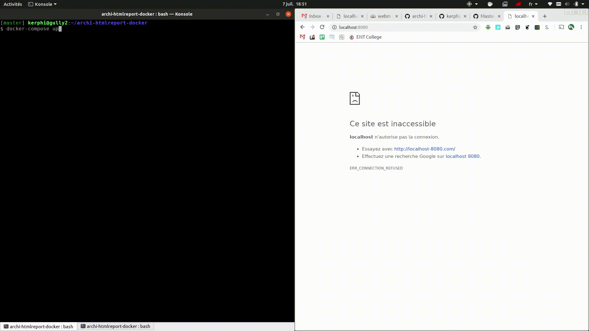

# archi-htmlreport-docker

[](https://hub.docker.com/r/abesesr/archi-htmlreport-docker/) [](https://github.com/abes-esr/archi-htmlreport-docker/actions/workflows/build-test-pubtodockerhub.yml)

Generates and exposes a HTML web site from an ArchiMateTool model (packaged with Docker 🐳)

We uses it internally at [Abes](http://abes.fr) to generate our "urbanization web site" helping us to know how is organized our IT system.



# Quickstart

```shell
docker run --rm -p 8080:80 \
  -e GIT_REPOSITORY="https://github.com/abes-esr/archi-model-example.git" \
  abesesr/archi-htmlreport-docker:1.6.4
```
Then browse to http://127.0.0.1:8080/ it will display the [demo ArchiMateTool model](https://github.com/abes-esr/archi-model-example.git) in a basic website.

# Parameters

Parameters coming from environment variables:

- `GIT_REPOSITORY` : git url of the archimatetool model (mandatory)
- `GIT_CHECK_EACH_NBMINUTES` : time to wait before checking again git repository change (default: 5 minutes)

Parameters coming from files (docker volumes):

If you need ssh to clone GIT_REPOSITORY, then you have to share the local id_ras ssh key in the container at this place:
  - `/root/.ssh/id_rsa.orig`
  - `/root/.ssh/id_rsa.pub.orig`
The container will copy it to `/root/.ssh/id_rsa` and `/root/.ssh/id_rsa.pub` with a correct chmod.

## GIT_REPOSITORY structure

GIT_REPOSITORY git repo should have somes data at a specific location:
- `model/` containing the multi xml files generated by ArchiMateTool IDE and its [Model Repository Collaboration Plugin](https://www.archimatetool.com/plugins/) (mandatory)
- `create-htmlreport.postscript.sh` will be executed each time the HTML report is generated juste after the generation (optional). 
- `create-htmlreport.prescript.sh` will be executed each time the HTML report is generated juste before the generation (optional). 


# Structure inside the container

- `/archi-model-git-repo/` contains the result of `git clone $GIT_REPOSITORY`
- `/archi-model-git-repo/model.archimate` is the onefile model autogenerated
- `/use/share/nginx/html-tmp/` is the folder where website is generated
- `/use/share/nginx/html/` is the nginx web folder where `html-tmp` is moved at the and of the scripts
- two files will be automaticaly created at the web root folder:
  - `/use/share/nginx/html/version.html`: contains the currently used docker image version
  - `/use/share/nginx/html/create-htmlreport.periodically.log.html`: contains the logs of the latest html report build (useful if there is errors)

# For production

```
mkdir archi-htmlreport/ && cd archi-htmlreport/
echo 'GIT_CHECK_EACH_NBMINUTES=5' > .env
echo 'GIT_REPOSITORY=https://github.com/abes-esr/archi-model-example.git' >> .env
wget https://raw.githubusercontent.com/abes-esr/archi-htmlreport-docker/master/docker-compose.yml
docker-compose up -d
```
(of course, adjust the GIT_REPOSITORY parameter)

Generated web site will listen on http://127.0.0.1:8080 (replace 127.0.0.1 by your server IP)

# For developers

To test it locally
```
docker build -t abesesr/archi-htmlreport-docker:1.6.4 .
docker run --rm -p 8080:80 --name archi-htmlreport-dev \
  -v $(pwd)/docker-entrypoint.sh:/docker-entrypoint.sh \
  -v $(pwd)/create-htmlreport.periodically.sh:/create-htmlreport.periodically.sh \
  -e GIT_CHECK_EACH_NBMINUTES=5 \
  -e GIT_REPOSITORY="https://github.com/abes-esr/archi-model-example.git" \
  abesesr/archi-htmlreport-docker:1.6.4
```

## Versioning

To generate a new version, just use the create-release.yml github action:  
https://github.com/abes-esr/archi-htmlreport-docker/actions/workflows/create-release.yml

It will autobuild a new docker image thanks to the [autobuild dockerhub system](ttps://hub.docker.com/r/abesesr/archi-htmlreport-docker/).
The latest generated docker image name and tag is:  
`abesesr/archi-htmlreport-docker:1.6.4`
